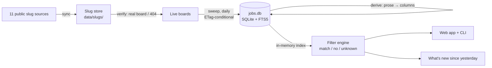

# UpstreamIt

[](https://github.com/ElliotGbaum/upstreamit/actions/workflows/test.yml)
[](https://github.com/ElliotGbaum/upstreamit/actions/workflows/deploy.yml)
[](LICENSE)

A job search engine that reads companies' own hiring systems instead of a job board's
index of them. It pulls from the public APIs of four applicant tracking systems (Ashby,
Greenhouse, Lever and, since late August 2026, Workday), sweeps every live board daily,
turns the free-text postings into columns a filter can reason about, and ranks them
against criteria you write once.

**Live: [upstreamit.io](https://upstreamit.io)** · [How it works, on the site](https://upstreamit.io/methodology)


## Why

Job boards sit downstream of the companies. They re-index postings on their own schedule,
rank them by criteria they don't publish, and sell placement in that ranking. The
software companies actually run their careers pages on (the ATS) publishes every open
role through a free, unauthenticated API. If you know a company's *slug* (the short name
in `jobs.ashbyhq.com/<slug>`), you can pull its entire req list in one request.

So this goes to the source, takes everything, and does the filtering locally. The hard
parts are finding the slugs, since no ATS publishes a customer list, turning prose into
data, and deciding what to do when a posting says nothing about something you filtered on.

## By the numbers

Measured 2026-08-27, the day Workday landed; the live counts are on the site.

| | |
| --- | --- |
| Open jobs | 967,277, each with its full description, from 16,441 live boards |
| Companies known | 21,029 (a board with no openings this month is kept; it will hire again) |
| ATSes | Ashby, Greenhouse, Lever and Workday, swept daily. Workday's first backfill, overnight on 2026-08-26, brought 627,436 jobs from 5,747 boards and made it two thirds of the corpus; BambooHR, Paylocity and iCIMS slugs are collected but not yet swept |
| Metros | 54,017, built from the location strings actually observed |
| A full filter run | a few seconds over the whole corpus, every facet counted, in memory |
| Tests | 795, covering derivation, filter, adapters, the store, accounts and AI interpret. No database, no network, ~1 s |
| Dependencies | one (`@anthropic-ai/sdk`, for the optional "describe your search"). Everything else is Node built-ins, including SQLite |

## How it works



Six stages, each a separate program that can be re-run on its own. The first two maintain
the slug store under `data/slugs/`, the next two write one SQLite database, and the last
two read it:

1. **Collect** merges company slugs from ten public datasets and a web-archive harvest,
   keeping provenance per slug. ETags detect upstream changes, so a poll that finds
   nothing new transfers nothing. → [`docs/sources.md`](docs/sources.md)
2. **Verify** asks each ATS whether a slug is a real board. Live and dead are recorded
   separately, with dates; the sweep marks a live board with no openings as empty.
   About half of collected slugs are dead.
3. **Sweep** pulls every open posting from every live board, daily. Ashby and Greenhouse
   honour conditional GET; Lever does not, which the Lever adapter documents. Every
   posting is stored with a content hash, and every observation goes into an event log,
   which is what makes "new since yesterday", "edited without announcement" and "gone"
   answerable. → [`docs/pipeline.md`](docs/pipeline.md)
4. **Derive** turns the title and description into columns: workplace, metro, salary
   (annualised, currency-converted, sanity-checked), years of experience, seniority, job
   function, skills, degree, clearance, visa sponsorship. It touches no network, so you
   can re-run it whenever a rule improves.
5. **Filter** runs a profile over those columns in memory. Every criterion returns one of
   three answers instead of two. → [`docs/filtering.md`](docs/filtering.md)
6. **Rank and show** orders what survived and says why each row is there, with a link to
   the company's own posting. → [`docs/app-and-accounts.md`](docs/app-and-accounts.md)

## The decisions worth knowing about

**A filter may rule a job out on evidence, never on silence.** 74% of postings publish
no salary; 62% never mention a degree. A salary floor that quietly drops the silent ones
hides most of the market while still looking like a working search. So every criterion
returns *match*, *no* or *unknown*, unknowns are kept by default, and every control on the
page shows what share of the corpus flipping it would drop. Of sixty job boards surveyed,
none had an equivalent ([`docs/filter-research.md`](docs/filter-research.md)).

**The ATSes publish different amounts, and the UI shows it.** Greenhouse's API has
no employment type field at all; Lever publishes the most per job; only Ashby has a clean
workplace enum. Those gaps appear as "unknown" shares next to each control instead of
being averaged away.

**The ATS fields themselves need checking.** The salary interval field lies: 154 rows said
"per year" for a figure under $1,000. A posting that states two experience requirements
disagrees with itself 82.5% of the time, and Ashby's `isRemote` is true for every hybrid
job. Each inference records which signal decided it, so a wrong answer can be traced to a
rule and the rule fixed without re-crawling eleven thousand boards.

**Nothing is pruned for being old.** A posting the company still publishes is still open,
whatever its date says: 13.8% of live postings are over a year old. You can filter by age
yourself, but nothing does it for you.

**Built-ins over dependencies.** `node:sqlite` with FTS5 for the corpus, `node:crypto`
scrypt for passwords, built-in `fetch` with conditional requests for the sweep. There is
no build step and no framework; the app is three served HTML pages and plain ES modules.

**One writer per file.** The daily run is split between GitHub Actions, which owns the
slug store and commits it, and a laptop launchd job, which owns the 3.5 GB database and
re-uploads it to the host by hand with `deploy/upload-db.sh`. Before the split both ran
the whole pipeline and fought over the same files every morning.
→ [`docs/automation.md`](docs/automation.md)

## Describe your search

The filter rail has forty controls. "Entry-level ops or solutions roles in NYC, nothing
needing a clearance, and I'll take remote" is one sentence and eleven of them, so there is
a box that takes the sentence and fills the controls in, using Claude with a tool schema
generated from the same enums the page uses. The model is deliberately not allowed to
decide what happens to unknowns, which is the one rule it is most likely to break. It
requires an account, because it spends money on every press, and it is off unless an API
key is configured.

## Accounts

Accounts are optional, and everything the app does works signed out. An account adds
memory: your saved filter sets, starred jobs, application status, and curated lists.
A ★, a ✓ and a × sit on every result — keep this one, I applied to this one, or never
show me this one again. A starred job ranks where it always did, marked; an applied one
is filed under Applied with the date on it; and both an applied and a hidden job are
subtracted from every later search before anything is counted, so a board cannot keep
offering back a job you have already answered. The results line says how many each
answer held back and links to the screen that has the way out of it.
Email + password (scrypt) or Google sign-in; `HttpOnly` `SameSite=Lax` sessions; CSRF
checks on every write; rate limits on login and signup. Accounts live in their own SQLite
file, separate from the corpus.

## Running it locally

Node 24, though 22.13 or later works (that is the release where `node:sqlite` stopped
needing a flag).

```bash
npm install
cp .env.example .env            # optional: add an Anthropic key for "describe your search"

npm run sync                    # pull the eleven slug sources → data/slugs/
npm run verify                  # probe slugs not yet resolved: real board / 404
npm run sweep                   # fetch every live board → data/jobs.db (hours, first time)
npm run derive                  # prose → columns

npm run serve                   # http://localhost:7799
npm run find                    # the same search, in the terminal
npm test                        # 771 checks, ~1 s
```

To try it without a multi-hour sweep, pull one ATS with a cap:
`node src/sweep.mjs --ats=lever --limit=200 && npm run derive && npm run serve`.

`npm run daily` runs the whole thing and writes a report of what is new since yesterday.
`npm run db` opens the database read-only in the `sqlite3` shell with
[`queries.sql`](queries.sql) as a starting point.

## Deploying

One Fly.io machine with a persistent volume for the database, accounts and profiles.
Pushing to `main` runs the tests and deploys the code; the database is uploaded
separately with `./deploy/upload-db.sh` because a 3.5 GB file does not belong in a
container image. → [`docs/deploy.md`](docs/deploy.md)

## Layout

```
src/
  sync-slugs.mjs      collect slugs from sources.json          lib/adapters/   one file per ATS
  probe-boards.mjs    verify slugs against the live APIs       lib/derive/     prose → columns
  sweep.mjs           fetch every live board                   lib/filter/     the engine, ranking, diffs
  derive.mjs          run the derivation pass                  lib/users/      accounts, sessions, Google
  find.mjs            run a profile from the terminal          lib/interpret.mjs  "describe your search"
  server.mjs          the web app and its JSON API             lib/db.mjs, schema.mjs
  daily.mjs           sweep + derive + "what's new"            *-test.mjs      the 771 checks
app/                  three served HTML pages (landing.html is kept, not routed), plain ES modules, no build
profiles/             filter profiles: portable JSON, read by the app, the CLI and the daily run
data/slugs/           the slug store (tracked; refreshed nightly by CI)
integrations/         sheet-sync.gs — pasted into a Google Sheet, reads the saved list over HTTP
docs/                 design notes, measurements, dead ends
```

## Documentation

- [`docs/design-notes.md`](docs/design-notes.md): what was established, what was ruled out and why, phase by phase
- [`docs/pipeline.md`](docs/pipeline.md): sync, verify, sweep, derive. Commands, flags, and what each ATS actually does
- [`docs/sources.md`](docs/sources.md): the eleven slug sources, what each one contributes, and attribution
- [`docs/filtering.md`](docs/filtering.md): the profile format, three-valued criteria, ranking
- [`docs/app-and-accounts.md`](docs/app-and-accounts.md): the app, "describe your search", accounts and what secures them
- [`docs/automation.md`](docs/automation.md): the daily run and the CI / laptop split
- [`docs/sheet-sync.md`](docs/sheet-sync.md): starring a job writes a row into a Google Sheet tracker
- [`docs/deploy.md`](docs/deploy.md): Fly.io, step by step
- [`docs/filter-research.md`](docs/filter-research.md): sixty job boards' filters, measured against this one
- [`docs/greenhouse-plan.md`](docs/greenhouse-plan.md): the measurements behind adding a second ATS

## Data and attribution

Job postings are read from each company's public ATS API and linked back to the
company's own posting; nothing is re-hosted for applying. Company slugs come from the
public datasets credited in [`docs/sources.md`](docs/sources.md), including
[latmay/ats-career-page-urls](https://huggingface.co/datasets/latmay/ats-career-page-urls)
(CC BY 4.0). The committed slug store (`data/slugs/`) is a merge of those datasets and is offered
under CC BY-SA 4.0 to honour the share-alike terms one of them carries; the code is MIT.

## License

[MIT](LICENSE), Elliot Greenbaum.
