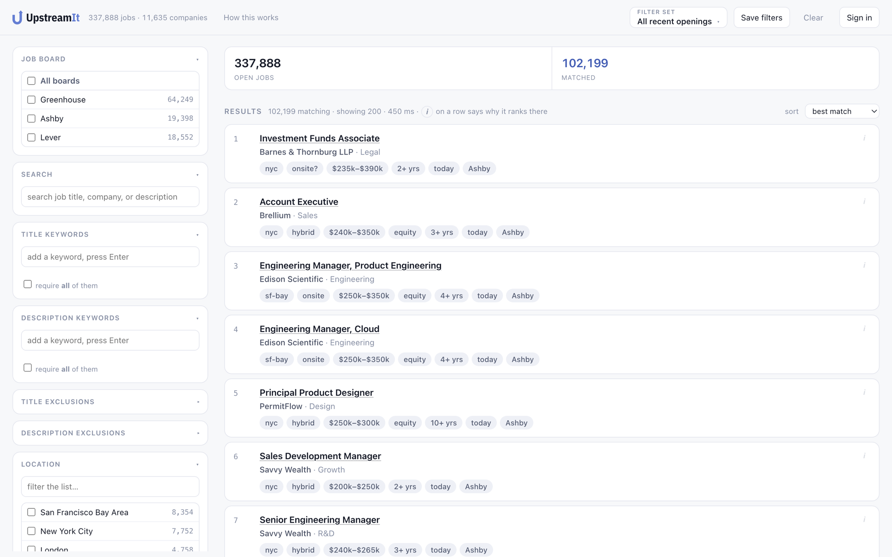
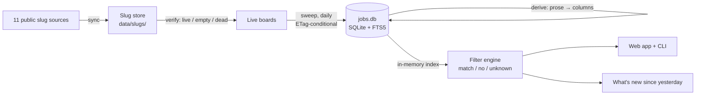

# UpstreamIt

[](https://github.com/ElliotGbaum/upstreamit/actions/workflows/test.yml)
[](https://github.com/ElliotGbaum/upstreamit/actions/workflows/deploy.yml)
[](LICENSE)

A job search engine that reads companies' own hiring systems instead of a job board's
index of them. It collects the public APIs of three applicant tracking systems — Ashby,
Greenhouse and Lever — sweeps every live board daily, turns the free-text postings into
columns a filter can reason about, and ranks them against criteria you write once.

**Live: [job-finder-ats.fly.dev](https://job-finder-ats.fly.dev)** · [How it works, on the site](https://job-finder-ats.fly.dev/methodology)



## Why

Job boards sit downstream of the companies. They re-index postings on their own schedule,
rank them by criteria they don't publish, and sell placement in that ranking. The
software companies actually run their careers pages on — the ATS — publishes every open
role through a free, unauthenticated API. If you know a company's *slug* (the short name
in `jobs.ashbyhq.com/<slug>`), you can pull its entire req list in one request.

So the design is one move: go to the source, take everything, and put the filtering on
your side of the wire. The hard problems are finding the slugs (no ATS publishes a
customer list), turning prose into data, and deciding what to do when a posting is silent
about something you filtered on.

## By the numbers

Measured 2026-08-24; the live counts are on the site.

| | |
| --- | --- |
| Open jobs | **337,925**, each with its full description, from **12,138 live boards** |
| Companies known | 15,207 (a board with no openings this month is kept — it will hire again) |
| ATSes | Ashby, Greenhouse, Lever — with Workday, BambooHR, Paylocity and iCIMS slugs collected but not yet swept |
| Metros | 24,337, built from the location strings actually observed |
| A full filter run | a few seconds over the whole corpus, every facet counted, in memory |
| Tests | **665** — derivation, filter, adapters, accounts, AI interpret — no database, no network, ~1 s |
| Dependencies | one (`@anthropic-ai/sdk`, for the optional "describe your search"). Everything else is Node built-ins, including SQLite |

## How it works



Six stages, each a separate program writing to one SQLite database, each re-runnable on
its own:

1. **Collect** — merge company slugs from eleven public datasets and a web-archive
   harvest, with provenance per slug. Upstream changes are detected with ETags, so a
   no-change poll transfers nothing. → [`docs/sources.md`](docs/sources.md)
2. **Verify** — ask each ATS whether the slug is a real board. Live, empty and dead are
   recorded separately, with dates. About half of collected slugs are dead.
3. **Sweep** — pull every open posting from every live board, daily. Ashby and Greenhouse
   honour conditional GET; Lever does not, and the code says so. Every posting is stored
   with a content hash and every observation goes into an event log, which is what makes
   "new since yesterday", "edited without announcement" and "gone" answerable.
   → [`docs/pipeline.md`](docs/pipeline.md)
4. **Derive** — turn the title and description into columns: workplace, metro, salary
   (annualised, currency-converted, sanity-checked), years of experience, seniority, job
   function, skills, degree, clearance, visa sponsorship. No network; re-run it whenever
   a rule improves.
5. **Filter** — run a profile over those columns in memory. Every criterion returns one of
   three answers, not two. → [`docs/filtering.md`](docs/filtering.md)
6. **Rank and show** — order what survived and say why each row is there, with a link to
   the company's own posting. → [`docs/app-and-accounts.md`](docs/app-and-accounts.md)

## The decisions worth knowing about

**A filter may rule a job out on evidence, never on silence.** 74% of postings publish
no salary; 62% never mention a degree. A salary floor that silently drops the silent
ones hides most of the market and still looks like a working search. So every criterion
returns *match*, *no* or *unknown*, unknowns are kept by default, and every control on the
page shows what share of the corpus flipping it would drop. Of sixty job boards surveyed,
none had an equivalent ([`docs/filter-research.md`](docs/filter-research.md)).

**The ATSes are not equivalent, and the UI says so.** Greenhouse's API has no employment
type field at all; Lever publishes the most per job; only Ashby has a clean workplace enum.
The gaps show up as "unknown" shares next to each control rather than being averaged away.

**Derived, not trusted.** The salary interval field lies (154 rows said "per year" for a
figure under $1,000), a posting stating two experience requirements disagrees with itself
82.5% of the time, and Ashby's `isRemote` is true for every hybrid job. Each inference
records which signal decided it, so a wrong answer can be traced to a rule and the rule
fixed without re-crawling eleven thousand boards.

**Nothing is pruned for being old.** A posting the company still publishes is still open,
whatever its date says — 13.8% of live postings are over a year old. Age is a filter you
can apply, never one applied for you.

**Built-ins over dependencies.** `node:sqlite` with FTS5 for the corpus, `node:crypto`
scrypt for passwords, built-in `fetch` with conditional requests for the sweep. There is
no build step and no framework; the app is three HTML pages and plain ES modules.

**One writer per file.** The daily run is split between GitHub Actions (owns the slug
store, commits it) and a laptop launchd job (owns the 4.5 GB database, uploads it to the
host). Before the split both ran the whole pipeline and fought over the same files every
morning. → [`docs/automation.md`](docs/automation.md)

## Describe your search

The filter rail has forty controls. "Entry-level ops or solutions roles in NYC, nothing
needing a clearance, and I'll take remote" is one sentence and eleven of them, so there is
a box that takes the sentence and fills the controls in, using Claude with a tool schema
generated from the same enums the page uses. The model is deliberately not allowed to
decide what happens to unknowns — that is the one rule it is most likely to break. It
requires an account, because it spends money on every press, and it is off unless an API
key is configured.

## Accounts

Optional. The signed-out app is the whole app. An account adds memory: your saved filter
sets, starred jobs, application status, and curated lists. Email + password (scrypt) or
Google sign-in; `HttpOnly` `SameSite=Lax` sessions; CSRF checks on every write; rate limits
on login and signup. Accounts live in their own SQLite file, separate from the corpus.

## Running it locally

Node 24 (22.5 or later works — `node:sqlite` is the floor).

```bash
npm install
cp .env.example .env            # optional: add an Anthropic key for "describe your search"

npm run sync                    # pull the eleven slug sources → data/slugs/
npm run verify                  # probe each slug: live / empty / dead
npm run sweep                   # fetch every live board → data/jobs.db (hours, first time)
npm run derive                  # prose → columns

npm run serve                   # http://localhost:7799
npm run find                    # the same search, in the terminal
npm test                        # 665 checks, ~1 s
```

To try it without a multi-hour sweep, pull one ATS with a cap:
`node src/sweep.mjs --ats=lever --limit=200 && npm run derive && npm run serve`.

`npm run daily` runs the whole thing and writes a report of what is new since yesterday.
`npm run db` opens the database read-only in the `sqlite3` shell with
[`queries.sql`](queries.sql) as a starting point.

## Deploying

One Fly.io machine with a persistent volume for the database, accounts and profiles.
Pushing to `main` runs the tests and deploys the code; the database is uploaded
separately with `./deploy/upload-db.sh` because a 4.5 GB file does not belong in a
container image. → [`docs/deploy.md`](docs/deploy.md)

## Layout

```
src/
  sync-slugs.mjs      collect slugs from sources.json          lib/adapters/   one file per ATS
  probe-boards.mjs    verify slugs against the live APIs       lib/derive/     prose → columns
  sweep.mjs           fetch every live board                   lib/filter/     the engine, ranking, diffs
  derive.mjs          run the derivation pass                  lib/users/      accounts, sessions, Google
  find.mjs            run a profile from the terminal          lib/interpret.mjs  "describe your search"
  server.mjs          the web app and its JSON API             lib/db.mjs, schema.mjs
  daily.mjs           sweep + derive + "what's new"            *-test.mjs      the 665 checks
app/                  three HTML pages, plain ES modules, no build
profiles/             filter profiles — portable JSON, read by the app, the CLI and the daily run
data/slugs/           the slug store (tracked; refreshed nightly by CI)
docs/                 design notes, measurements, dead ends
```

## Documentation

- [`docs/design-notes.md`](docs/design-notes.md) — what was established, what was ruled out and why, phase by phase
- [`docs/pipeline.md`](docs/pipeline.md) — sync, verify, sweep, derive: commands, flags, and what each ATS actually does
- [`docs/sources.md`](docs/sources.md) — the eleven slug sources, what each one contributes, and attribution
- [`docs/filtering.md`](docs/filtering.md) — the profile format, three-valued criteria, ranking
- [`docs/app-and-accounts.md`](docs/app-and-accounts.md) — the app, "describe your search", accounts and what secures them
- [`docs/automation.md`](docs/automation.md) — the daily run and the CI / laptop split
- [`docs/deploy.md`](docs/deploy.md) — Fly.io, step by step
- [`docs/filter-research.md`](docs/filter-research.md) — sixty job boards' filters, measured against this one
- [`docs/greenhouse-plan.md`](docs/greenhouse-plan.md) — the measurements behind adding a second ATS

## Data and attribution

Job postings are read from each company's public ATS API and linked back to the
company's own posting; nothing is re-hosted for applying. Company slugs come from the
public datasets credited in [`docs/sources.md`](docs/sources.md), including
[latmay/ats-career-page-urls](https://huggingface.co/datasets/latmay/ats-career-page-urls)
(CC BY 4.0). The committed slug store (`data/slugs/`) is a merge of those datasets and is offered
under CC BY-SA 4.0 to honour the share-alike terms one of them carries; the code is MIT.

## License

[MIT](LICENSE) — Elliot Greenbaum.
